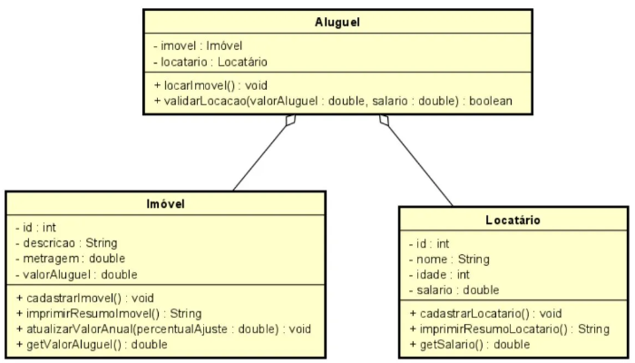

# Sistema de Gestão de Locações de Imóveis

Este repositório contém a implementação de um sistema para gerenciar as locações de imóveis, desenvolvido em Java utilizando os princípios da programação orientada a objetos (POO). Este projeto foi realizado como parte da disciplina **Programação 3** no curso de **Análise e Desenvolvimento de Sistemas**.

## 📋 Descrição do Projeto

O sistema foi projetado para automatizar o processo de locação de imóveis em uma imobiliária. Ele permite o cadastro de imóveis, locatários e valida a locação com base no salário informado. O objetivo é garantir que o valor do aluguel não ultrapasse 30% da renda do locatário.

### 🛠️ Funcionalidades

- Cadastro de Imóveis
- Cadastro de Locatários
- Validação de Locação (baseado em 30% do salário)
- Exibição de resumo do imóvel e do locatário
- Atualização do valor do aluguel com reajuste anual

## 📐 Diagrama de Classes



## ▶️ Executando o Projeto

1. Clone o repositório:

```bash
git clone https://github.com/seu-usuario/MAPA_Programacao3.git
```

2. Navegue até o diretório do projeto:

```bash
cd Java_MAPA_Programacao3/src
```

3. Compile o projeto:

```bash
javac Main.java
```

4. Execute a aplicação:

```bash
java Main
```

## 🧑‍💻 Requisitos

- Java 8 ou superior
- IDE de sua preferência (recomendado: IntelliJ IDEA, Eclipse, VSCode)

## 📚 Aprendizados

Este projeto reforça conceitos importantes de programação orientada a objetos, como:

- Encapsulamento
- Associação entre classes
- Validação de regras de negócio
- Entrada e saída de dados com `JOptionPane`

## 📌 Contribuição

Contribuições são bem-vindas! Sinta-se à vontade para abrir issues e pull requests.

## 📄 Licença

Este projeto é apenas para fins educacionais e não possui uma licença específica.
